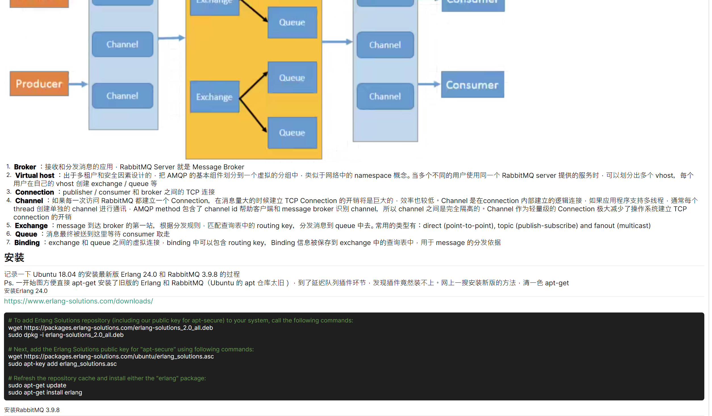

# Markdig.Avalonia
Avalonia的Markdown解析器

已经默认渲染

* 标题语法
* 段落语法
* 强调语法
* 引用语法
* 列表语法
* 代码语法
* 分隔线语法
* 链接语法
* 图片语法
* Html标签
* 代码块

## 使用方式

App.xaml

```xaml
 <StyleInclude Source="avares://Markdig.Avalonia/Index.axaml"/>
```

MainView

``` xaml
<avalonia:MarkView Text="{Binding Text}" />
```

MainViewModel

```csharp
public partial class MainViewModel : ObservableObject
{
    public MainViewModel()
    {
        // 先加载主题
        CodeThemeManager.AddTheme(ThemeName.DarkPlus);
    }


    [ObservableProperty] private string? _text;

    [RelayCommand]
    private async Task LoadMarkdown()
    {
        Text = await File.ReadAllTextAsync(Path.Combine(Directory.GetCurrentDirectory(), "Markdown", "Demo.md"));
    }

    [RelayCommand]
    private void Empty()
    {
        Text = "";
    }
}
```


## 演示截图

演示文档来自 [Naccl's Blog](https://naccl.top/blog/24)



目前还只是初步的demo...

